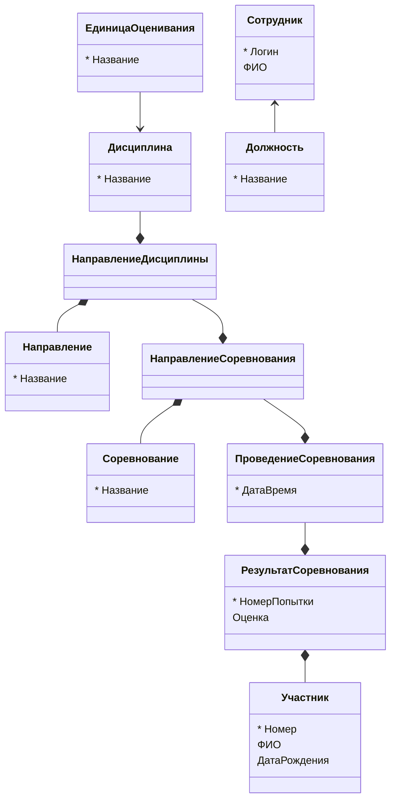

```mermaid
classDiagram
	ЕдиницаОценивания --> Дисциплина
	Дисциплина --* НаправлениеДисциплины
	НаправлениеДисциплины *-- Направление
	НаправлениеДисциплины --* НаправлениеСоревнования
	НаправлениеСоревнования *-- Соревнование
	НаправлениеСоревнования --* ПроведениеСоревнования
	ПроведениеСоревнования --* РезультатСоревнования
	РезультатСоревнования *-- Участник
	Сотрудник <-- Должность
	
class Должность{
	* Название
}
class Сотрудник{
	* Логин
	ФИО
}
class ЕдиницаОценивания{
	* Название
}
class Дисциплина{
	* Название
}
class Направление{
	* Название
}
class Соревнование{
	* Название
}
class ПроведениеСоревнования{
	* ДатаВремя
}
class Участник{
	* Номер
	ФИО
	ДатаРождения
}
class РезультатСоревнования{
	* НомерПопытки
	Оценка
}

```