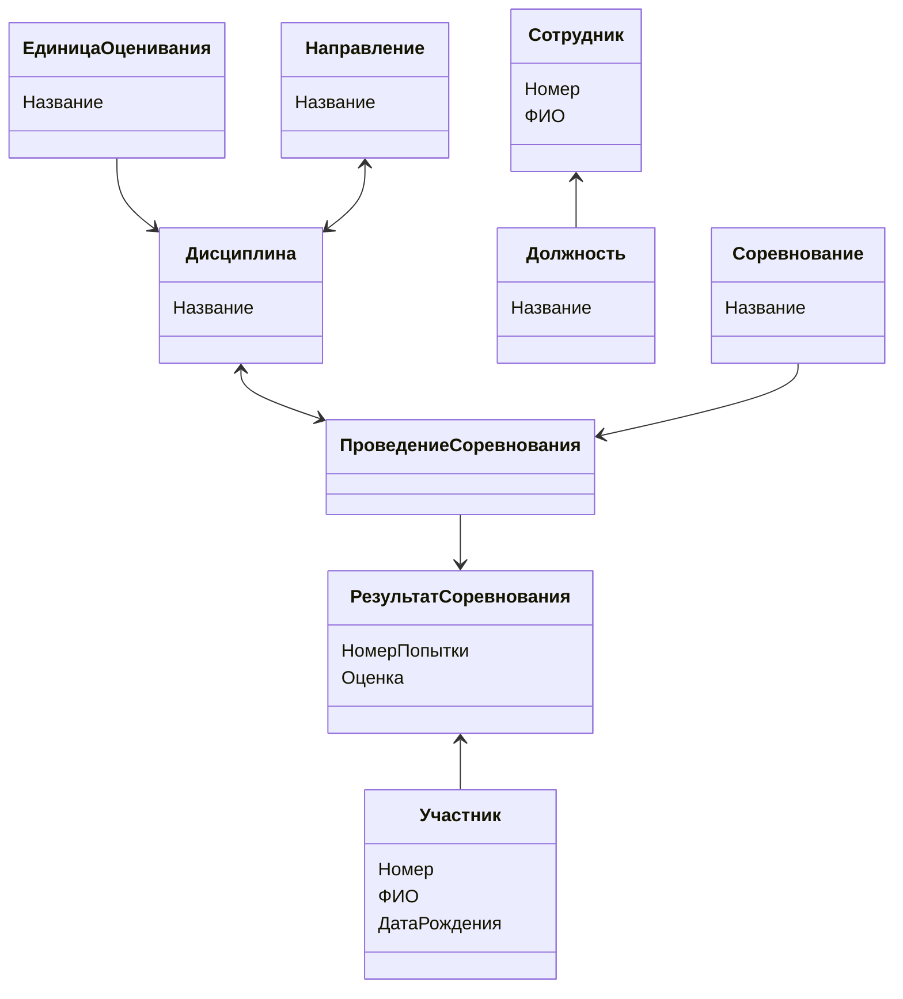

```mermaid
classDiagram
      ЕдиницаОценивания --> Дисциплина
      ПроведениеСоревнования --> РезультатСоревнования
      РезультатСоревнования <-- Участник
      Сотрудник <-- Должность
      Направление <--> Дисциплина
      Дисциплина <--> ПроведениеСоревнования
      Соревнование --> ПроведениеСоревнования
      
      class ЕдиницаОценивания{
          Название
      }
      class Дисциплина{
          Название
      }
      class Соревнование{
          Название
      }
      class Участник{
          Номер
          ФИО
          ДатаРождения
      }
      class РезультатСоревнования{
          НомерПопытки
          Оценка
      }
      class Сотрудник{
          Номер
          ФИО
      }
      class Должность{
          Название
      }
      class Направление{
          Название
      }
```